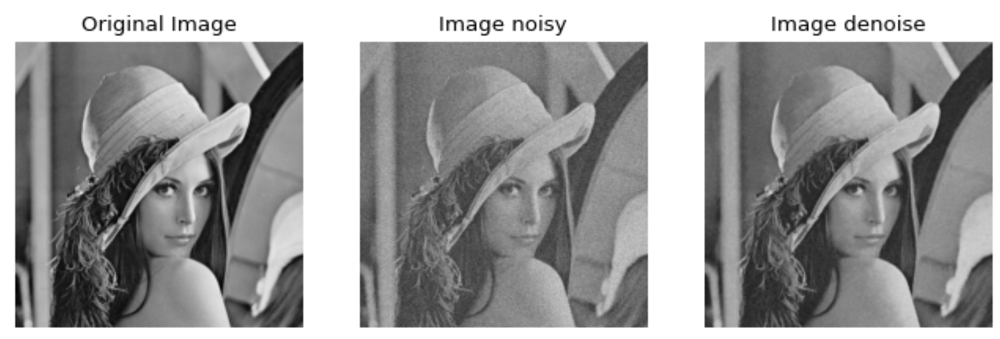

# The Implementation of Classical Methods for Image Enhancement


## Table of Contents

- [Introduction](#introduction)
- [Installation](#installation)
- [Quickstart](#quickstart)
- [Contributing](#contributing)


## Introduction

The repository is structured as follows:

```
├── LICENSE            <- Open-source license if one is chosen
├── README.md          <- The top-level README for developers using this project.
├── samples            <- Example images for testing the methods.
├── outputs             <- Trained and serialized models, model predictions, or model summaries
├── notebooks          <- Jupyter notebooks. Naming convention is a number (for ordering),
├── requirements.txt   <- The requirements file for reproducing the analysis environment, e.g.
├── setup.cfg          <- Configuration file for flake8
└── image_enhancement                <- Source code for use in this project.
    ├── __init__.py    <- Makes image_enhancement a Python module
```

## Installation

To re-produce this project, you will need to have the following dependencies installed:
- Ubuntu 18.04.6 LTS
- [Miniconda](https://docs.conda.io/en/latest/miniconda.html)
- Python 3

After installing Miniconda, you can create a new environment and install the required packages using the following commands:

```bash
conda create -n enhancer python=3.9
conda activate enhancer
pip install -r requirements.txt
```

## Quickstart

To reproduce experiments, please refer:
```bash
bash run.sh
```

## Contributing

All contributions are welcome. 